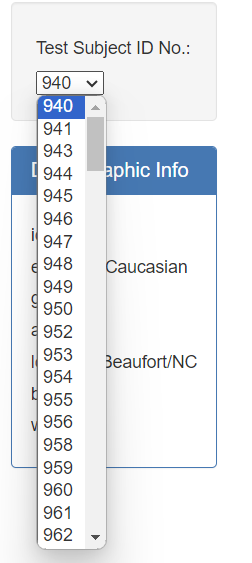
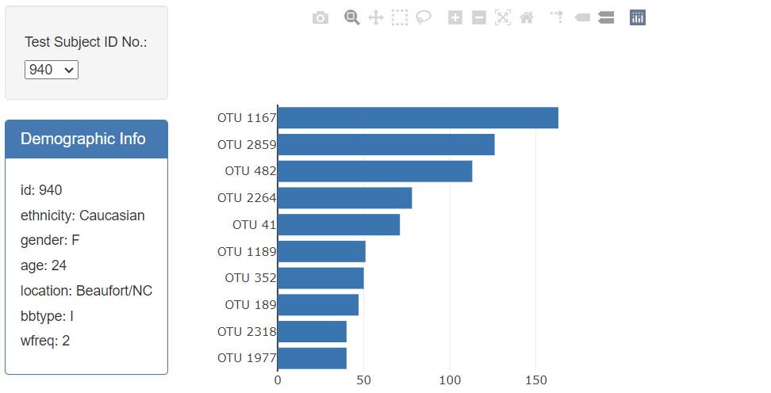
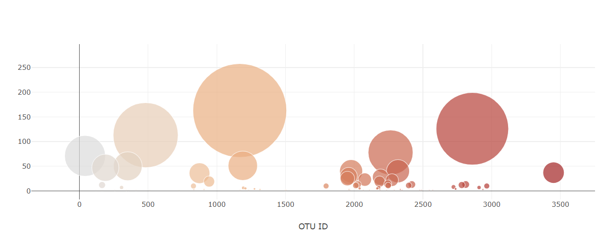
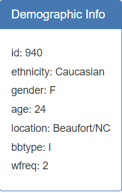

# Belly Button Biodiversity

## Details
An interactive dashboard to explore the Belly Button Biodiversity datasetLinks to an [external site] (https://2u-data-curriculum-team.s3.amazonaws.com/dataviz-classroom/v1.1/14-Interactive-Web-Visualizations/02-Homework/samples.json), which catalogs the microbes that colonize human navels.

The dataset reveals that a small handful of microbial species (also called operational taxonomic units, or OTUs, in the study) were present in more than 70% of people, while the rest were relatively rare.

## Interactive dashboard

**a horizontal bar chart with a dropdown menu**

It displayed the top 10 OTUs found in that individual

**a bubble chart**

It displayed each sample based on the size of the sample_values and the otu_ids

**demographic information**

Displayed the sample metadata, i.e., an individual's demographic information, of each key-value pair from the metadata JSON object 

